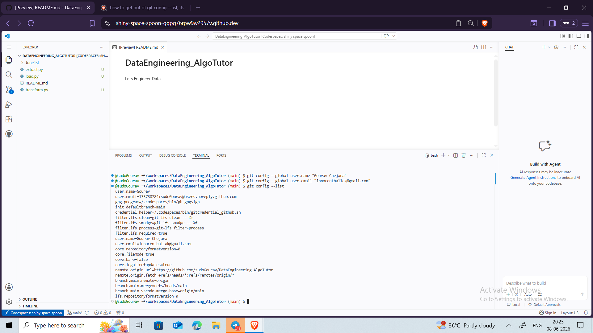
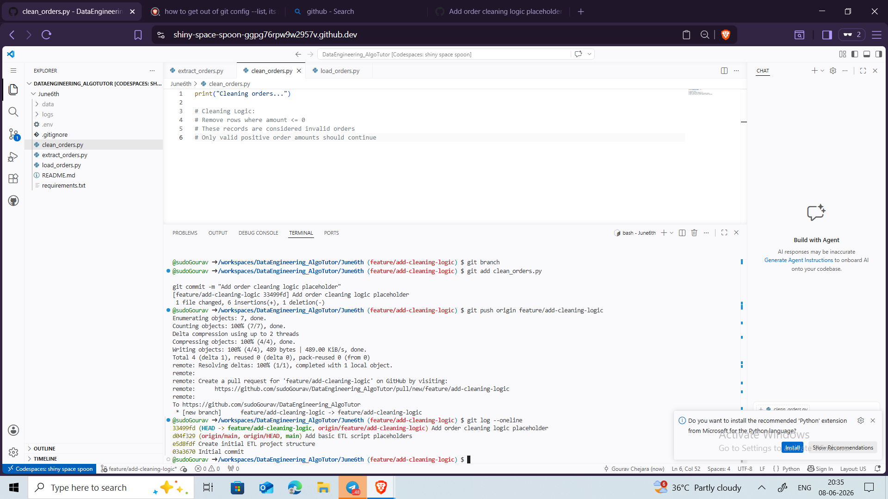
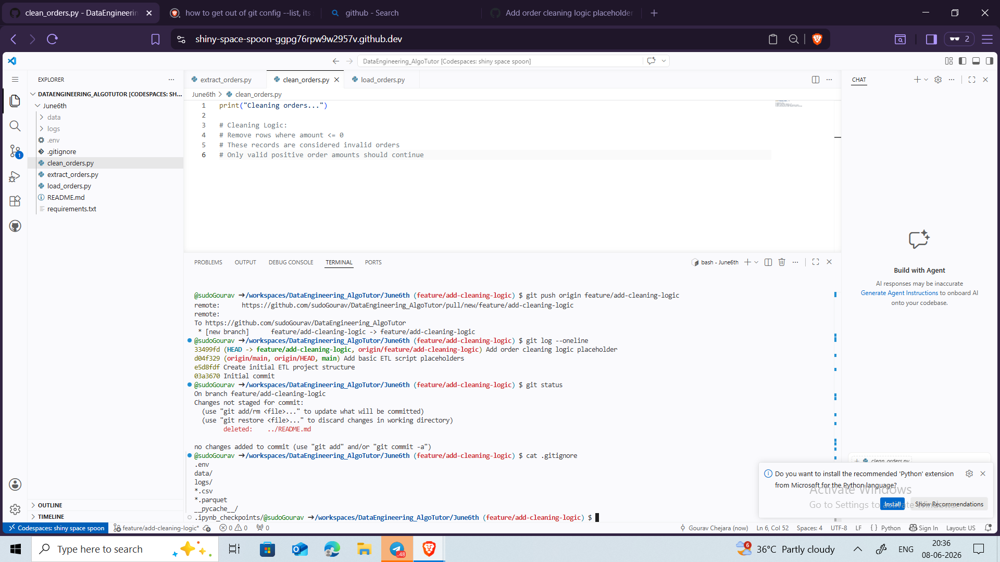
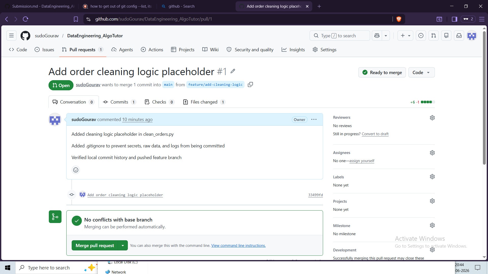

# Git & GitHub Assignment Submission

## Repository URL

https://github.com/sudoGourav/DataEngineering_AlgoTutor

## Pull Request URL

https://github.com/sudoGourav/DataEngineering_AlgoTutor/pull/1

## Why .env and Data Were Ignored

The .env file contains sensitive credentials such as database passwords and should never be committed to version control.

The data directory contains raw datasets that may be large, change frequently, or contain sensitive information. Data Engineers typically store data separately and only version-control code and configuration files.

## Screenshots Included

## Screenshot: Git Configuration

## Screenshot: Git Log

## Screenshot: Git Status

## Screenshot: .gitignore

## Screenshot: Pull Request

